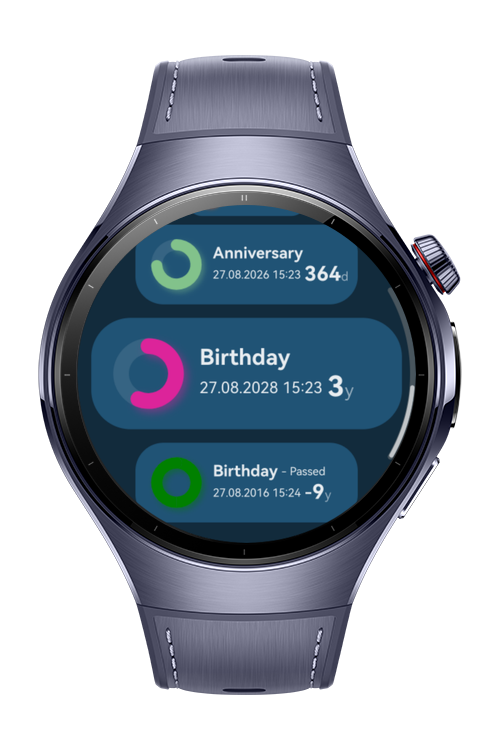
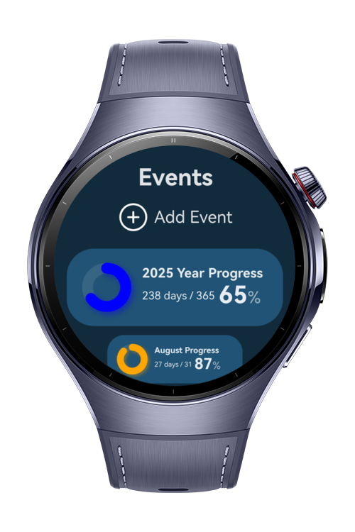
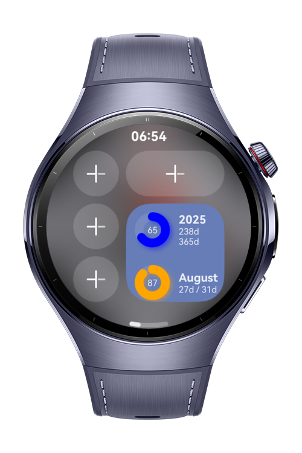
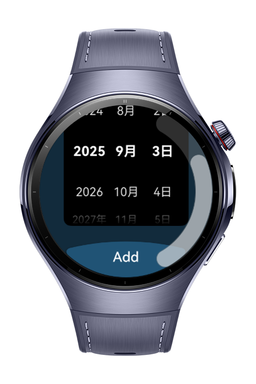

> **Note:** To access all shared projects, get information about environment setup, and view other guides, please visit [Explore-In-HMOS-Wearable Index](https://github.com/Explore-In-HMOS-Wearable/hmos-index).

# EventCountdownApp

EventCountdownApp app helps users to view important dates progress and as well yearly, monthly and daily progresses. 

# Preview
<div>
  
  
  
  
</div>

# Use Cases

EventCountdownApp provides usefully stats and tracking of your events.

# Tech Stack

- **Languages**: ArkTS, ArkUI
- **Frameworks**: HarmonyOS SDK 6.0.0(20)
- **Tools**: DevEco Studio Vers 6.0.0.841
- **Libraries**: @kit.ArkUI

# Directory Structure

```
entry/src/main/ets/
├───components                           
│       CalendarEventProgress.ets
|       DailyProgress.ets                    
│       EventMenuItem.ets                
│       Header.ets                
│       Icon.ets                
|       MonthlyProgress.ets
|       YearlyProgress.ets                
├───entryability                         
│       EntryAbility.ets                 
├───entrybackupability                   
│       EntryBackupAbility.ets                                   
├───entryformability                   
│       EntryFormAbility.ets                                   
├───models
|       CalendarManager.ets
|       GlobalContext.ets
├───lib
│       constants.ts
│       utils.ts
├───viewmodels
│       EventProgressModel.ts
├───views
|       AddEventView.ets
│       HomeView.ets
├───widget
|       components
|           MonthlyCard.ets
|           YearlyCard.ets
│       pages
│           WidgetCard.ets
├───pages
|        AddEventPage
|        Index.ets
```

# Constraints and Restrictions
## Supported Device
- Huawei Watch 5

# LICENSE
**EventCoundownApp** is distributed under the terms of the MIT License.
See the [license](LICENSE) for more information. 